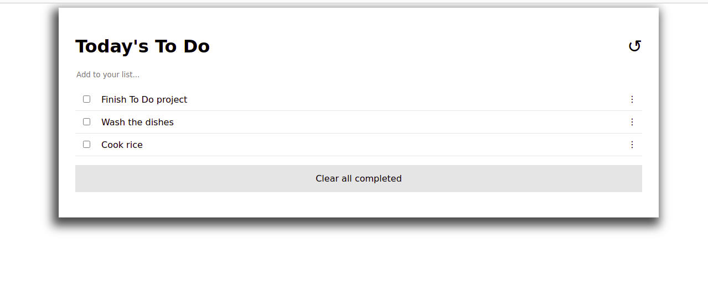

# To Do List
This project consists of building a to do list webpage, demonstrating JS, Webpack, HTML and CSS skills.

## Screenshot

## Live Demo
[Live Demo Link](https://rayan84.github.io/to-do-list/dist/)

## Built With
* CSS
* HTML
* JavaScript
* VS Code
* ESLint

## Authors

## Rayan Rassam
* Github:[@Rayan84](https://github.com/Rayan84)
* Twitter:[@Rayan65096267](https://twitter.com/Rayan65096267)
* LinkedIn:[rayan-rassam](https://www.linkedin.com/in/rayan-rassam/)

## Contributing
Contributions, issues and feature requests are welcome!
Feel free to check the [Issue](https://github.com/Rayan84/to-do-list/issues) and help me improve!